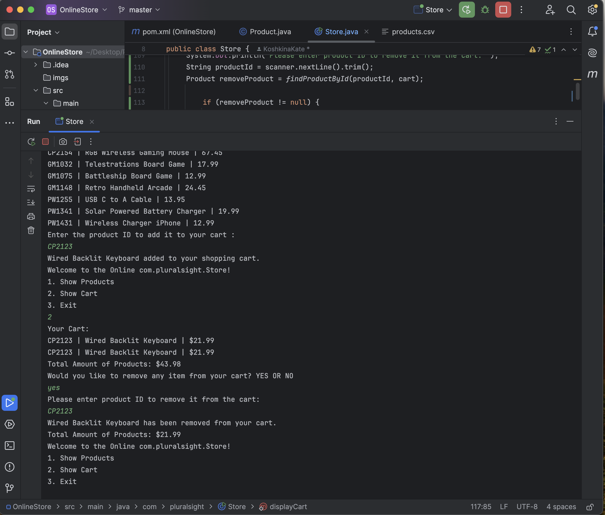

# Online Store 

## Description of the Project

This Java console application simulates an online store, allowing users to view products, manage a shopping cart, and proceed to checkout. Users can browse available products, add or remove items from the cart, and confirm purchases.

## User Stories

The following user stories guided the development of this application:

- **As a customer**, I want to view all available products so that I can decide what to purchase.
- **As a customer**, I want to add products to my cart so that I can purchase them later.
- **As a customer**, I want to remove products from my cart so that I can manage my purchases.

## Setup

Instructions on how to set up and run the project using IntelliJ IDEA.

### Prerequisites

- IntelliJ IDEA: Ensure you have IntelliJ IDEA installed, which you can download from [here](https://www.jetbrains.com/idea/download/).
- Java SDK: Make sure Java SDK is installed and configured in IntelliJ.

### Running the Application in IntelliJ

Follow these steps to get your application running within IntelliJ IDEA:

1. Open IntelliJ IDEA.
2. Select "Open" and navigate to the directory where you cloned or downloaded the project.
3. After the project opens, wait for IntelliJ to index the files and set up the project.
4. Find the main class with the `public static void main(String[] args)` method.
5. Right-click on the file and select 'Run 'YourMainClassName.main()'' to start the application.

## Technologies Used

- Java 17: This project is written using Java version 17.
- IntelliJ IDEA: Used as the primary Integrated Development Environment (IDE) for coding and running the project.

## Demo
### Displaying Available Product and The Total Price

### Removing Product from the cart

## Future Work

- User Authentication: Allow users to create accounts and log in to manage their orders.
- Payment Integration: Implement a simulated payment system for users to enter payment details.

## Thanks

- Thank you to Raymond for continuous support and guidance.